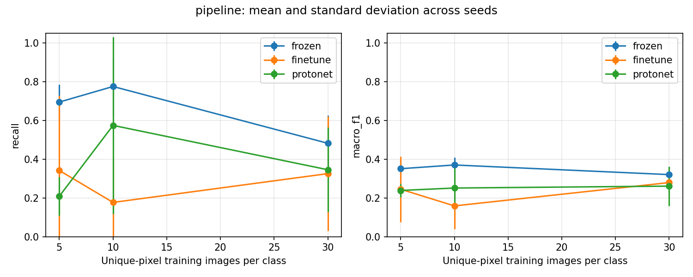

# Thực nghiệm thăm dò phân loại ảnh CT gan

Ngày chạy: 01/10/2026. Đã hoàn tất **3 phương pháp × K=5/10/30 × seed=42/43/44**,
tương ứng 27 cặp mô hình, 54 artifact theo tầng và 81 bộ metrics cho presence/subtype/pipeline.
Trạng thái bằng chứng: `EXPLORATORY_UNKNOWN_ANCESTRY_AND_UNVERIFIED_LABELS`.

## Phạm vi dữ liệu và kết luận

Theo thông tin tác giả cung cấp, ảnh có nguồn từ Bệnh viện K và nhãn do bác sĩ gán.
Hiện thiếu mã bệnh nhân, quan hệ ảnh gốc–augmentation và hồ sơ xác minh quy trình gán nhãn.
Giữ các trường này là trống/unknown; không tự tạo bệnh nhân hoặc đánh dấu ảnh gốc.

K chỉ là **số ảnh có decoded pixels khác nhau mỗi lớp được chọn huấn luyện**.
Những ảnh khác pixels vẫn có thể thuộc cùng bệnh nhân hoặc là biến thể của một ảnh.
Do đó kết quả chỉ mô tả so sánh kỹ thuật trong bộ ảnh hiện có; chưa chứng minh
hiệu năng trên bệnh nhân mới, hiệu quả lâm sàng hoặc tiết kiệm nhãn trên bệnh nhân độc lập.
Việc công bố mức chia tập và giới hạn phù hợp với [CLAIM 2024, mục 20 và 40](https://pubs.rsna.org/doi/10.1148/ryai.240300).

| Split | File | Decoded pixels độc nhất |
|---|---:|---:|
| Train | 958 | 942 |
| Validation | 240 | 236 |
| Test hiện có | 95 | 93 |

Chia theo nhóm pixels với seed 42: giữ test folder, chia phần còn lại khoảng 80/20.
Không có pixels trùng hoàn toàn qua các split. Test pipeline sau bỏ bản sao trùng gồm
5 no_tumor, 5 benign và 83 malignant. Validation/test có thể chứa augmentation cũ do
không biết ancestry. Tập test này đã xuất hiện trong quá trình phát triển/lượt pilot;
đây không phải test mới chưa từng được tiếp cận hay kiểm thử bên ngoài bệnh viện.

## Cấu hình đã chốt

- ResNet-34 ImageNet cho cả ba phương pháp: frozen + prototype, fine-tune cross-entropy,
  và ProtoNet với projection head v3, khoảng cách Euclid bình phương.
- Mỗi task/K/seed dùng cùng danh sách ảnh có nhãn giữa các phương pháp; hai phương pháp
  huấn luyện dùng cùng chỉ số ảnh episode, chính sách augmentation và thiết lập optimizer.
  RNG augmentation cụ thể có thể khác giữa các kiến trúc.
- RGB, resize 224×224, ImageNet normalization; không crop Otsu lại. Chỉ áp dụng
  augmentation mới khi huấn luyện: flip ngang 0,5, rotation 10°, brightness/contrast jitter 0,1.
- Adam, lr=5e-5, weight decay=1e-4; tối đa 500 bước mỗi tầng; validation mỗi 10 bước
  và bước đầu/cuối; dừng sau 10 lần validation không cải thiện.
- Checkpoint chọn bằng validation macro-F1 ở ngưỡng 0,5. Sau đó khóa ngưỡng từ validation:
  tối đa precision với recall validation ≥0,90. Đây không bảo đảm recall test đạt 0,90.
- Episode support/query tối đa 5 ảnh/lớp mỗi phần, tách biệt và giới hạn theo K.
  Prototype suy luận dùng đúng toàn bộ K ảnh/lớp đã chọn. Nhãn validation/test là chi phí bổ sung.
- RTX 3070, PyTorch 2.5.1+cu121, torchvision 0.20.1+cu121, CUDA 12.1,
  batch inference 32, bốn CPU threads. Xem [config](results/benchmark-20261001/config.json)
  và [số bước/checkpoint đã chọn](results/benchmark-20261001/training.csv).

## Kết quả pipeline

Mean ± sample standard deviation qua ba seed; recall/FN/FP/specificity tính cho malignant
so với hai lớp còn lại. Macro-F1 và accuracy tính trên ba lớp. AUC dùng tích hai stage scores
làm điểm xếp hạng chưa hiệu chỉnh; không phải xác suất chẩn đoán lâm sàng.

| Method | K images/class | Malignant recall | Specificity | Macro-F1 (3 classes) | AUC | FN | FP |
|---|---:|---:|---:|---:|---:|---:|---:|
| finetune | 5 | 0.341 ± 0.386 | 0.867 ± 0.153 | 0.245 ± 0.169 | 0.707 ± 0.072 | 54.667 ± 32.036 | 1.333 ± 1.528 |
| frozen | 5 | 0.695 ± 0.091 | 0.400 ± 0.000 | 0.351 ± 0.043 | 0.621 ± 0.073 | 25.333 ± 7.572 | 6.000 ± 0.000 |
| protonet | 5 | 0.209 ± 0.101 | 0.967 ± 0.058 | 0.238 ± 0.034 | 0.648 ± 0.159 | 65.667 ± 8.386 | 0.333 ± 0.577 |
| finetune | 10 | 0.177 ± 0.235 | 0.933 ± 0.115 | 0.159 ± 0.120 | 0.574 ± 0.230 | 68.333 ± 19.502 | 0.667 ± 1.155 |
| frozen | 10 | 0.775 ± 0.151 | 0.333 ± 0.321 | 0.370 ± 0.039 | 0.572 ± 0.071 | 18.667 ± 12.503 | 6.667 ± 3.215 |
| protonet | 10 | 0.574 ± 0.457 | 0.500 ± 0.500 | 0.251 ± 0.108 | 0.508 ± 0.138 | 35.333 ± 37.899 | 5.000 ± 5.000 |
| finetune | 30 | 0.325 ± 0.296 | 0.800 ± 0.200 | 0.279 ± 0.053 | 0.549 ± 0.051 | 56.000 ± 24.556 | 2.000 ± 2.000 |
| frozen | 30 | 0.482 ± 0.145 | 0.567 ± 0.208 | 0.320 ± 0.040 | 0.545 ± 0.044 | 43.000 ± 12.000 | 4.333 ± 2.082 |
| protonet | 30 | 0.345 ± 0.217 | 0.933 ± 0.058 | 0.261 ± 0.102 | 0.678 ± 0.050 | 54.333 ± 18.037 | 0.667 ± 0.577 |

Trong cấu hình và bộ ảnh này, mean macro-F1 pipeline của ProtoNet thấp hơn đối chứng
frozen ở cả ba K. Kết quả chưa ủng hộ kết luận ProtoNet vượt đối chứng; biến động recall
qua seed lớn và pipeline còn bỏ sót nhiều ảnh mang nhãn malignant. Đây là phát hiện
của lượt thăm dò, không phải kiểm định thống kê về ưu thế phương pháp hay chẩn đoán bệnh nhân.

Accuracy bị ảnh hưởng mạnh bởi mất cân bằng: luôn dự đoán malignant đã đạt
89.25% accuracy, macro-F1 0.314, recall malignant 1,0 và specificity 0.
Đây là đối chứng hằng để diễn giải dữ liệu, không phải mô hình được huấn luyện.
Mỗi lỗi trên năm ảnh của một lớp nhỏ thay đổi recall lớp đó 20 điểm phần trăm.

Xem [toàn bộ 27 dòng tổng hợp theo tầng/K/phương pháp](results/benchmark-20261001/summary.csv),
[81 bộ metrics với confusion matrix và CI](results/benchmark-20261001/results.json),
và [FN malignant theo tầng gây lỗi](results/benchmark-20261001/error_summary.csv).
Bootstrap 200 lượt theo nhóm pixels, bỏ lượt chỉ có một lớp và ghi số lượt hợp lệ;
các CI này không phải khoảng tin cậy theo bệnh nhân. Biến động qua seed cũng không sửa
được rò rỉ do ancestry chưa biết.

Kiểm chứng kỹ thuật đã tải lại toàn bộ 54 artifact, tái tính score test và đối chiếu
với CSV dự đoán: sai khác lớn nhất bằng 0. Đã đối chiếu 81 bộ metrics, 27 dòng
mean/std, support chỉ thuộc train và giống nhau giữa các phương pháp, checkpoint/ngưỡng
chọn từ validation. App đã chạy với cặp ProtoNet K=30, seed 42; hash của 1.293 ảnh nguồn
giữ nguyên. Xem [bằng chứng kiểm chứng](results/benchmark-20261001/validation.json).
Các kiểm tra này xác nhận tính nhất quán của phần mềm; không xác minh tính độc lập
theo bệnh nhân hay tính đúng đắn lâm sàng của nhãn.



## Tái chạy và demo

```powershell
python prepare_data.py --data-root data --out prepared/current_files --exploratory-files --seed 42
python run_experiments.py --manifest prepared/current_files/manifest.csv --data-root data --out runs/benchmark --exploratory-files --budgets 5 10 30 --seeds 42 43 44 --steps 500 --val-every 10 --patience 10 --batch-size 32 --bootstrap 200 --threads 4 --device cuda
streamlit run app/app.py
```

Mọi output directory phải mới; nếu đã tồn tại, chọn tên run mới và cập nhật app config.
CPU cũng được hỗ trợ qua `--device cpu`. Cần cùng bộ ảnh nguồn để tái tạo kết quả thật;
repo cung cấp cấu hình/hash nhưng không chứa dữ liệu bệnh viện.

App mặc định dùng ProtoNet K=30, seed 42 đã xác định trước, không chọn bằng test metrics.
App/evaluator dùng chung preprocessing, prototype, score, class mapping và validation threshold.
Trọng số và ảnh nguồn giữ ngoài Git; predictions theo ảnh/error galleries được giữ trong
run local để phân tích. Tệp công khai chỉ gồm mã và kết quả tổng hợp, không có ảnh y khoa,
patient identifiers hoặc đường dẫn riêng của máy tác giả.

## Hướng phát triển sau lượt này

Ưu tiên tập dữ liệu mới có định danh ca chụp và quy trình nhãn truy vết được để kiểm thử
độc lập; sau đó mới kết luận về tổng quát hóa hoặc thay đổi kiến trúc. Không chọn lại
hyperparameters/ngưỡng từ bảng test ở trên rồi báo cáo đó như kiểm thử độc lập.
