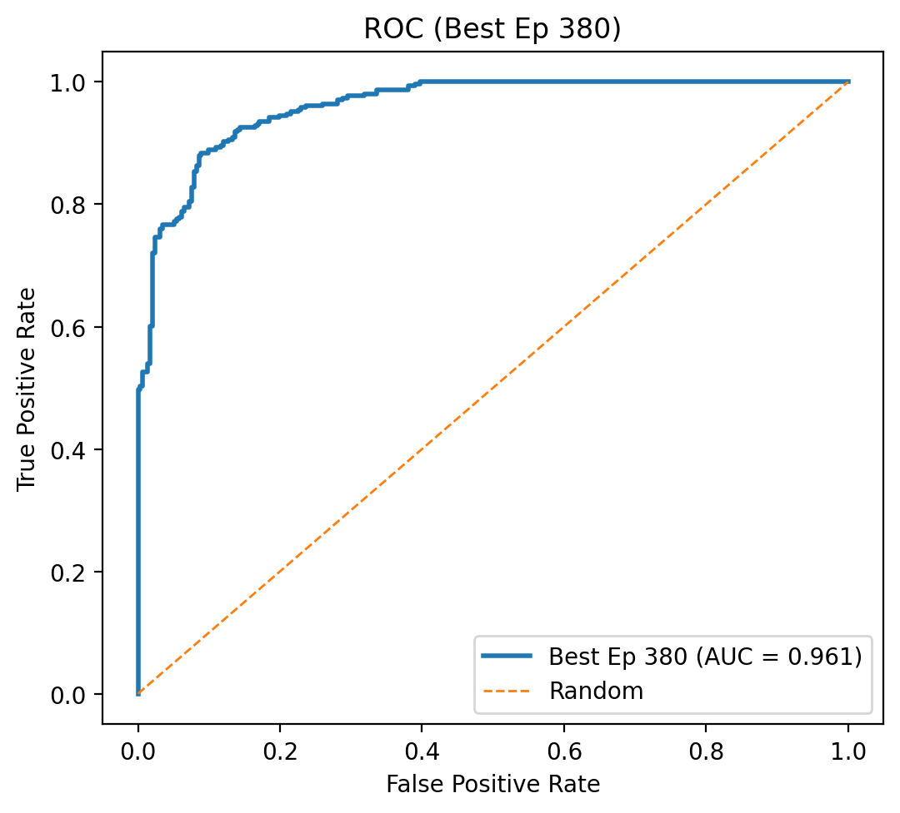
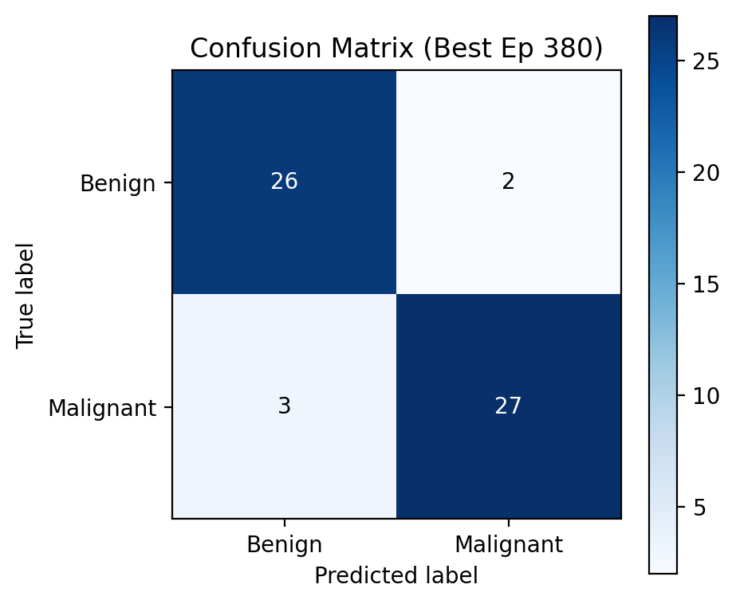
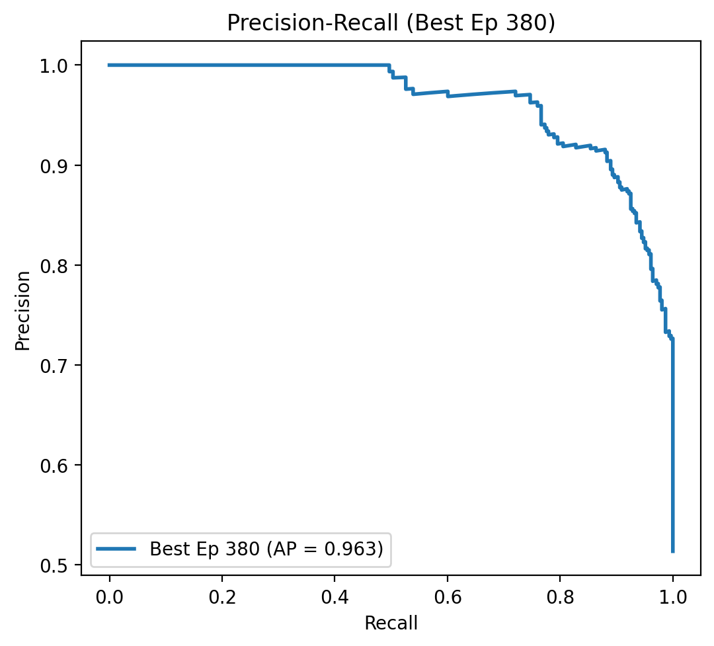

# Liver Tumor Classification with Few-Shot Learning

A deep learning system for classifying liver tumor CT images as **benign** or **malignant** using **Prototypical Networks** with a **ResNet-34** backbone — trained with only a few labeled examples per class (few-shot learning).

## Highlights

- **2-Stage Pipeline**: Stage 1 detects tumor presence → Stage 2 classifies benign vs malignant
- **Few-Shot Learning**: Prototypical Networks with K-shot support sets — no need for massive labeled datasets
- **Interactive Demo**: Streamlit web app for real-time classification (upload up to 2 CT images)

## Results

| Model | Task | Key Metric |
|-------|------|------------|
| ProtoNet + ResNet34 | Tumor Detection (Stage 1) | See `results/` |
| ProtoNet + ResNet34 | Benign vs Malignant (Stage 2) | AUC = 95.9%, Recall = 85.4% |

<p align="center">
  
  
  
</p>

## Project Structure

```
liver-tumor-fewshot/
├── app/                          # Streamlit demo app
│   ├── app.py                    # Main application
│   └── config.yaml               # Path configuration
├── notebooks/                    # Training & evaluation
│   ├── 01_preprocess.ipynb
│   ├── 02_preprocess_class_tumor.ipynb
│   ├── 03_train_class_tumor.ipynb
│   ├── 04_train_protonet_v1.ipynb
│   ├── 05_train_protonet_v2.ipynb
│   ├── 06_eval_roc_curve.ipynb
│   ├── 07_train_protonet_v3.ipynb
│   └── 08_eval_false_negatives.ipynb
├── models/                       # Pre-trained weights (see below)
├── data/                         # Support-set images (see below)
├── results/
│   ├── figures/                  # ROC, PR, Confusion Matrix plots
│   └── metrics/                  # Training logs
├── .gitignore
├── README.md
└── requirements.txt
```

## Setup

### 1. Install Dependencies

```bash
pip install -r requirements.txt
```

### 2. Download Models & Data

Model weights (`.pth`, ~85 MB each) and support-set images are too large for GitHub.

**Download from Google Drive**: [link here]

After downloading, place files as follows:
```
models/
├── best_protonet_class_liver_tumor_resnet34.pth    # Stage 1: Tumor detection
├── improved_protonet_liver_tumor_resnet34.pth      # Stage 2: Benign/Malignant (v2)
└── v3_protonet_liver_tumor_resnet34.pth            # Stage 2: Benign/Malignant (v3)

data/
├── train/                  # Stage 2: Benign / Malignant
│   ├── benign/
│   └── malignant/
├── train_presence/         # Stage 1: Tumor / No Tumor
│   ├── no_tumor/
│   └── tumor/
└── test/                   # Test set
    ├── benign/
    ├── malignant/
    ├── malignant_extra/
    └── no_tumor/
```

### 3. Run Demo App

```bash
cd app
streamlit run app.py
```

## Tech Stack

- **Framework**: PyTorch + TorchVision
- **Model**: ResNet-34 (ImageNet pretrained) as feature extractor
- **Method**: Prototypical Networks (few-shot metric learning)
- **Preprocessing**: OpenCV (Otsu thresholding, contour extraction, grayscale filtering)
- **App**: Streamlit

## License

Academic project — MHP501 Thesis.
